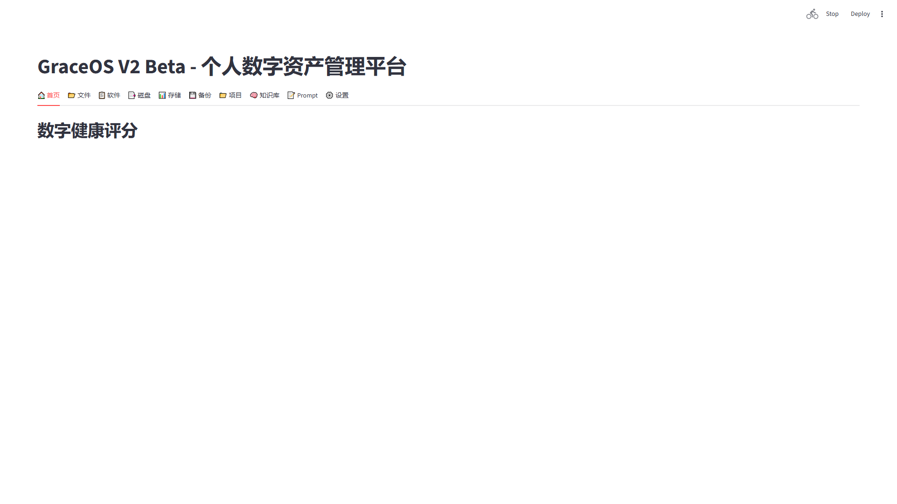
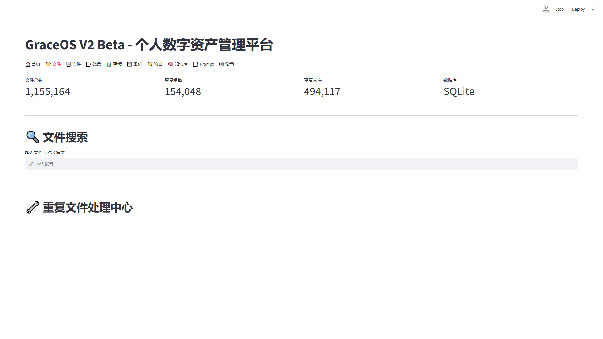
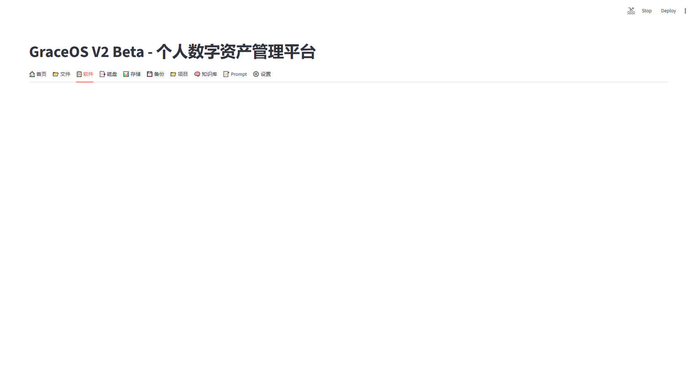
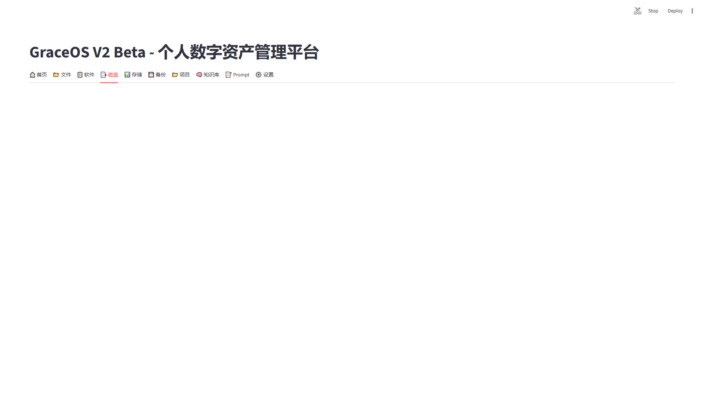

# GraceOS — Personal Digital Operating System

> **发现问题 → 分析问题 → 给出建议 → 执行处理**
> 优雅地管理你的数字生活

---

## 产品介绍

GraceOS 是一套**个人数字资产管理系统**。不只是一个文件管理工具——它是你电脑的数字仪表盘，帮你发现问题、分析原因、给出可执行建议。

| 核心能力 | 说明 |
|---------|------|
| 🔍 资产盘点 | 自动扫描文件(115万+)、软件(142个)、磁盘 |
| 📊 健康评分 | 0-100 分量化数字资产健康度 |
| 🤖 AI 建议 | 自动分析+推荐处理方案 |
| ⚡ 一键执行 | 删除/归档/备份，从建议到处理形成闭环 |

## 解决的问题

| 痛点 | 解决方案 |
|------|---------|
| "C盘又满了" | 磁盘监控 + 空间预警 + 释放建议 |
| "重复文件太多" | 自动检测 154K+ 重复组，智能建议保留哪个 |
| "微信文件堆积" | 长期未用文件处理中心，一键归档 |
| "软件多版本混乱" | 多版本检测 + 建议保留最新 |
| "不知道从哪里开始整理" | 首页 AI 建议中心，从最优先问题开始 |

## 适用人群

- 🧑‍💻 开发者（多Git仓库、磁盘管理痛点）
- 📋 产品经理（多项目并行、文档分散）
- 💼 知识工作者（下载堆积、文件找不到）
- 🚀 AI 重度用户（Cursor/Codex/ChatGPT 日常使用）

## 功能截图

### 首页仪表盘 — 健康评分 + AI 建议


### 文件资产中心 — 搜索 + 重复处理 + 未使用清理


### 软件资产中心 — 清单 + 多版本检测


### 磁盘资产中心 — 容量监控 + 预警


## 快速开始

### 双击启动（推荐）

```
双击 Start_GraceOS.bat
    ↓
自动检查环境 + 首次初始化
    ↓
浏览器自动打开 http://localhost:8501
```

### 首次启动

首次运行自动完成：
1. 安装 Python 依赖
2. 扫描已安装软件
3. 扫描磁盘信息
4. 计算初始健康评分
5. 启动 Dashboard

**预计时间**: ~2 分钟

> 完整文件扫描（全盘索引）需单独运行: `python main.py`

## 技术栈

| 层面 | 技术 |
|------|------|
| 前端 | Streamlit 1.58 |
| 数据库 | SQLite |
| 扫描器 | winget + winreg + os.walk |
| 评分引擎 | Python (analyzers/health_scorer.py) |
| 截图 | Playwright |

## 项目结构

```
GraceOS_V1/
├── dashboard.py              # 主应用 (10 Tabs)
├── Start_GraceOS.bat         # 一键启动 🚀
├── main.py                   # 扫描入口
├── scanners/                 # 扫描器 (software/disk/file)
├── analyzers/                # 分析器 (health_scorer)
├── docs/                     # 设计文档和报告
├── screenshots/              # 页面截图
├── DEVELOPMENT_RULES.md      # 开发规范
├── PROJECT_STATUS.md         # 项目状态
├── ROADMAP.md                # 路线图
└── INSTALL_GUIDE.md          # 安装指南
```

## 版本历史

| 版本 | 里程碑 |
|------|--------|
| V1 RC1 | 文件/软件/磁盘资产管理 |
| V2 Alpha | 健康评分 + 10-tab Dashboard |
| V2 Beta | 资产处理中心 + AI建议 + 一键启动 |

## 路线图

| 版本 | 内容 | 状态 |
|------|------|------|
| V1.0 | 核心资产管理 | ✅ |
| V1.5 | 稳定与优化 | 🟡 |
| V2.0 | 智能资产管理 | ✅ |
| V2.1 | Demo Mode + 安装包 | 📋 规划 |
| V3.0 | 企业扩展 | 📋 远期 |

## 文档

- [安装指南](INSTALL_GUIDE.md)
- [开发规范](DEVELOPMENT_RULES.md)
- [系统架构](docs/GraceOS_V2_ARCHITECTURE.md)
- [数据库设计](docs/DATABASE.md)
- [发布说明](docs/RELEASE_NOTE.md)

## License

MIT
